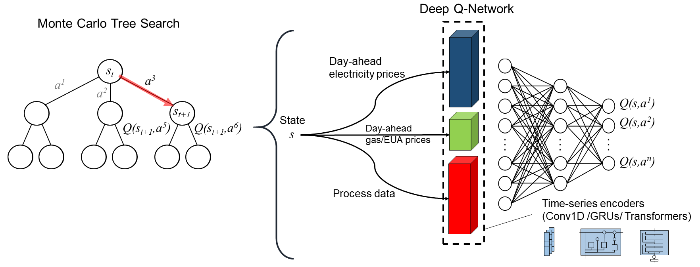
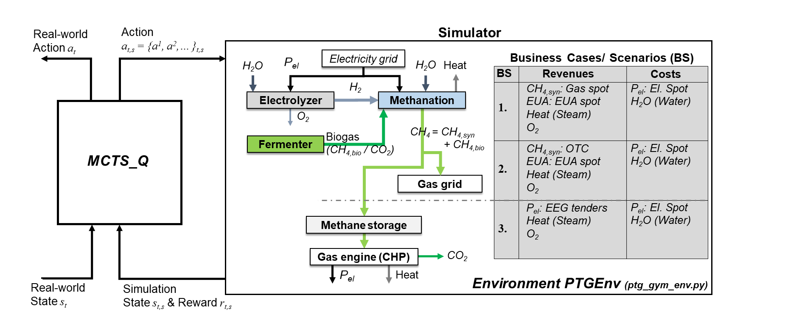
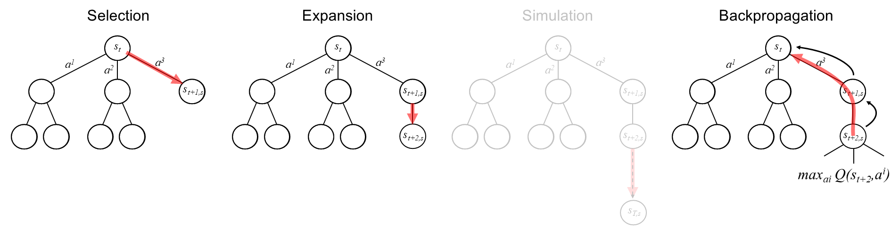

# MCTS_Q

The **MCTS_Q** project provides the source code of a control algorithm combining *Monte Carlo Tree Search* (MCTS) and *Deep-Q-Network* (DQN). 
It is designed for the economic optimization of Power-to-Gas (PtG) dispatch but can be adapted to other control tasks as well.
PtG is a technology that enables the chemical energy storage of renewable energy in chemical energy carriers such as hydrogen (H<sub>2</sub>) or methane (CH<sub>4</sub>). by using MCTS and DQN, **MCTS_Q** incorporates both planning and learning capabilities, allowing it to adapt to dynamic environments and optimize the dispatch of PtG plants based on process data and Day-ahead electricity, natural gas, and emissions spot market data.

This repository contains the source code for the **MCTS_Q** algorithm and the new version of the **PtGEnv** environment, which has already been published in [RL_PtG](https://github.com/SimMarkt/RL_PtG).  



*Figure 1: Architecture of the MCTS_Q algorithm with DQN-based guidance for the MCTS search tree.*

---

## Table of Contents

1. [Overview](#overview)
2. [Project structure](#project-structure)
3. [Installation and Usage](#installation-and-usage)
4. [License](#license)
5. [Citing](#citing)
6. [References](#references)

---

## Overview

**MCTS_Q** is written in Python and includes a data-driven process model of a real-world PtG plant in **PtGEnv** (adapted from [1, 2]). This section gives an overview of the application and details the MCTS algorithm used. For more information about **PtGEnv**, please refer to [1, 2].

### Application

The application details are also stated in [2] (https://github.com/SimMarkt/RL_PtG); for the sake of completeness, they are also included here.

The PtG process typically begins with water electrolysis, where an electric current is used to split water (H<sub>2</sub>O) into hydrogen and oxygen (O<sub>2</sub>). **MCTS_Q** assumes a proton exchange membrane (PEM) electrolyzer with a load-dependent efficiency modeled after a commercial system [3]. The efficiency has been derived using experimental data and linear regression with nonlinear basis functions [1].  

In addition to PEM electrolysis, **MCTS_Q** incorporates a chemical methanation unit that converts hydrogen and carbon dioxide (CO<sub>2</sub>) into methane. Since biogas contains a significant amount of CO₂ (up to 55%), this process utilizes biogas as a carbon source. To accurately model the methanation unit's process dynamics—which dominate the overall PtG system dynamics—the approach integrates a time-series process model based on experimental data from a real-world pilot plant.  

The experimental data captures plant behavior during startup, load changes, cooldown, and standby operations of the methanation unit. In standby mode, the reactor temperature is maintained at approximately 190°C to enable a rapid warm startup. The data-driven process model switches between different time-series datasets to simulate dynamic plant operations. This approach is both simple and highly accurate and provides that the plant operates consistently and predictably [1].  

Figure 2 illustrates the current PtG process, where the produced CH<sub>4</sub> can either be injected into the natural gas grid or used in a gas engine for combined heat and power (CHP) generation. The various methods of processing and selling CH<sub>4</sub> define three distinct business scenarios (BS) within this application:  

- **BS1**: Trades CH<sub>4</sub> on the natural gas spot market.  
- **BS2**: Sells CH<sub>4</sub> to a bilateral partner via Over-the-Counter (OTC) contracts.  
- **BS3**: Integrates a CHP plant and sells the generated electrical power (*P<sub>el</sub>*) through special tenders under the German Renewable Energy Act (EEG).  

Additional revenue sources include heat, oxygen, and European Emission Allowances (EUA). Since BS1 and BS2 bind CO₂ in methane, they can generate revenue by selling EUAs through the European Emissions Trading System (EU-ETS). The primary operational costs of the process include electricity and water, with electricity being purchased from the German Day-ahead spot market.  

**MCTS_Q** integrates historical electricity market data from `data/spot_market_data/`, sourced from SMARD [4]. The original research and Reinforcement Learning (RL) training in [1] also utilized historical market data for gas and EUA from MONTEL [5]. However, due to licensing restrictions, the present repository only includes synthesized datasets that replicate the statistical properties and non-linear characteristics of the original data.  

The **MCTS_Q** framework models the complete PtG process, including PEM electrolysis, chemical methanation, and energy market data, within the **PtGEnv** environment (*Gymnasium* framework). For an overview of the project's directories and files, refer to the [Project Structure](#project-structure) section.  



*Figure 2: Optimization framework for Power-to-Gas dispatch using MCTS_Q and the PtGEnv environment including the different business cases.*

### The MCTS_Q Algorithm

**MCTS_Q** combines *Monte Carlo Tree Search* with *Deep-Q-Network* to optimize the PtG dispatch task. MCTS is a planning algorithm that builds a search tree based on simulations, while DQN is a reinforcement learning algorithm that learns a value function to guide the search process. 
The principal architecture of **MCTS_Q** is based on previous successful implementations of MCTS with DQN guidance, such as the *AlphaZero* algorithm for board games [6], *MuZero* for Atari games [7], and *MCTS_NNET* for motion control [8].
The present approach adapts these concepts to the PtG dispatch optimization task with *time-series encoders* for the process dynamics and energy market data and *prioritized experience replay* for higher data efficiency.

Deep RL offers a promising approach for optimizing the economic operation of chemical plants, handling both the **non-linearity** and **stochasticity** of process dynamics and market behavior. 

#### <u>MCTS details</u>

The MCTS algorithm is a rollout-based approach for decision-time planning. In this context, decision-time planning means that computations are performed at the moment a decision is needed, rather than constructing a complete plan in advance [9].

MCTS operates in a loop consisting of four main steps (see Fig. 3), incrementally building a search tree to guide decision-making. The loop runs for a predefined number of iterations:

1. **Selection:**
Starting from the root node, MCTS recursively selects child nodes according to a tree/selection policy until a leaf node is reached.
The tree policy balances exploration (trying less-visited nodes) and exploitation (choosing high-reward nodes).
Typical policies are based on *Upper Confidence Bound for Trees* (UCT).
**MCTS_Q** incorporates the PUCT policy, which is a variant of UCT that uses the Q-value from a DQN to guide the selection process [6]. The PUCB policy is defined as follows:

<pre> ``` aₜ = argmaxₐ [ Q(s, a) / N(s, a) + c * P(s, a) * sqrt(N(s)) / (1 + N(s, a)) ] ``` </pre>

Q(s,a): Total reward from simulations for this child.
N(s,a): Number of times this child has been visited.
N(s): Number of times the parent node has been visited.
P(s, a): Prior probability of the action a in state s, derived from `softmax(Q(s,a))`.
c: Exploration constant.

The exloration constant c moreover changes with the number of visits to the parent node, which is defined as follows [6]:

<pre> ``` c = ln((1 + N(s) + cᵦₐₛₑ) / cᵦₐₛₑ) + cᵢₙᵢₜ ``` </pre>

cᵢₙᵢₜ: Initial exploration constant.
cᵦₐₛₑ: Base exploration constant.

2. **Expansion:**
If the selected node is not terminal and has untried actions, **MCTS_Q** expands the tree by creating one or more child nodes for those actions.

3. **Simulation (Rollout):**
Srandard MCTS performs a simulation from the newly expanded node to estimate the value of that node.
In **MCTS_Q**, the simulation is replaced by a DQN-based value estimation. The Q-value of the leaf node is computed using the DQN model. This Q-value serves as an estimate of the expected cumulative reward for the actions taken from that node.

4. **Backpropagation:**
MCTS propagates the simulation result back up the tree, updating statistics (like visit counts and total reward) for each node along the path.



*Figure 3: The phases of the Monte Carlo Tree Search algorithm — Selection, Expansion, Simulation and Backpropagation. Simulation is omitted in **MCTS_Q** as it uses the Q-Values at the leaf node for backpropagation.*

**Note:** During the Selection and Expansion steps, **MCTS_Q** uses action masking to ensure only valid actions are considered. These valid actions are defined by the programmable logic controller (PLC) of the real-world PtG plant and depend on its operational state [1]. The following table outlines the possible actions::

| Operation State  | Startup | Partial Load | Full Load | Cooldown | Standby |
|----------------|-----------------|-----------------|-----------------|-----------------|-----------------|
| *a_Startup*   | ✅               | ❌              | ❌              | ✅               | ✅               |
| *a_PartialLoad* |   ❌           | ✅               | ✅               | ❌              | ❌             |
| *a_FullLoad*   |  ❌            | ✅               | ✅               | ❌              | ❌             |
| *a_Cooldown* |  ✅               | ✅               | ✅               | ✅               | ✅               |
| *a_Standby* |   ✅               | ✅               | ✅               | ✅               | ✅               |

#### <u>DQN details</u>

**MCTS_Q** uses a Deep-Q-Network (DQN) to estimate the Q-values of actions in the search tree. The DQN is trained using experience replay and target networks to stabilize learning. The DQN architecture consists of three different time-series encoders for Day-ahead electricity market data (1hour-resolution), Day-ahead gas and EUA market data (1day-resolution), and process data (Up to 2second-resolution). These encoders can convert the high-dimensional time-series data into a lower-dimensional representation suitable for the DQN. The DQN then processes these representations through several fully connected layers with ReLU activation functions, followed by an output layer that predicts Q-values for each action.
The DQN model uses the Python library *Pytoch* for neural network implementation and training. The loss function is the mean squared error (MSE) between the predicted Q-values and the target Q-values, which are computed using the Bellman equation. The model is trained using the *Adam* optimizer with standard coefficients. 

The source code of **MCTS_Q** provides three different encoder types:
- **`ConvAttentionEnc`**: Convolutional Neural Network (Conv1D) with Attention Mechanism.
- **`GRUAttentionEnc`**: Gated Recurrent Unit (GRU) with Attention Mechanism.
- **`TransformerEnc`**: Transformer Encoder.

These encoders can be configured in `config/config_mctsq.yaml` and are used to process the time-series data from the PtG environment. (There are still ongoing investigations to determine which encoder performs best for the PtG dispatch optimization task.)

In addition to the encoders, **MCTS_Q** also includes a *Prioritized Experience Replay* mechanism to improve data efficiency. This mechanism prioritizes experiences based on their importance, allowing the DQN to learn more effectively from rare but significant events.

---

## Project Structure

The project is organized into the following directories and files:

```plaintext
MCTS_Q/
│
├── config/
│   ├── config_env.yaml
│   ├── config_mctsq.yaml
│   └── config_train.yaml
│
├── data/
│   ├── OP1/
│   ├── OP2/
│   └── spot_market_data/
│
├── env/
│   ├── ptg_gym_env_per.py
│   └── ptg_gym_env.py
│
├── logs/
│
├── plots/
│
├── src/
│   ├── mctsq_config_dqn_per.py
│   ├── mctsq_config_dqn.py
│   ├── mctsq_config_env.py
│   ├── mctsq_config_mctsq_per.py
│   ├── mctsq_config_mctsq.py
│   ├── mctsq_config_train.py
│   ├── mctsq_opt.py
│   └── mctsq_utils.py
│
├── tensorboard/
│
├── requirements.txt
├── mctsq_main_per.py
├── mctsq_main.py
└── mctsq_tb.py

```

### `config/`  
Contains configuration files for the project:  
- **`config/config_env.yaml`**: Configuration for the PtG environment.
- **`config/config_mctsq.yaml`**: Configuration for the **MCTS_Q** algorithm including hyperparameters.   
- **`config/config_train.yaml`**: Configuration for the training procedure.  

### `data/`
Stores process data for two load levels (**OP1** and **OP2**) with different dynamics, along with energy market data:  
- **`data/OP.../data-meth_cooldown.csv`**: Cold startup data.
- **`data/OP.../data-meth_op1_start_p.csv`**: Partial load after startup.
- **`data/OP.../data-meth_op2_start_f.csv`**: Full load after startup.
- **`data/OP.../data-meth_op3_p_f.csv`**: Partial to full load transition.
- **`data/OP.../data-meth_op4_p_f_p_5.csv`**: Partial to full load and back after 5 min.
- **`data/OP.../data-meth_op5_p_f_p_10.csv`**: Partial to full load and back after 10 min.
- **`data/OP.../data-meth_op6_p_f_p_15.csv`**: Partial to full load and back after 15 min.
- **`data/OP.../data-meth_op7_p_f_p_20.csv`**: Partial to full load and back after 20 min.
- **`data/OP.../data-meth_op8_f_p.csv`**: Full to partial load transition.
- **`data/OP.../data-meth_op9_f_p_f_5.csv`**: Full to partial load and back after 5 min.
- **`data/OP.../data-meth_op10_f_p_f_10.csv`**: Full to partial load and back after 10 min.
- **`data/OP.../data-meth_op11_f_p_f_15.csv`**: Full to partial load and back after 15 min.
- **`data/OP.../data-meth_op12_f_p_f_20.csv`**: Full to partial load and back after 20 min.
- **`data/OP.../data-meth_standby_down.csv`**: From operation to standby.
- **`data/OP.../data-meth_standby_up.csv`**: # From idle state to standby.
- **`data/OP.../data-meth_startup_cold.csv`**: Cold startup data.
- **`data/OP.../data-meth_startup_hot.csv`**: Warm startup data.
- **`data/OP.../data-meth_cooldown.csv`**: Cooldown data.
- **`data/spot_market_data/data-day-ahead-el-test.csv`**: Day-ahead electricity spot market data for testing.
- **`data/spot_market_data/data-day-ahead-el-train.csv`**: Day-ahead electricity spot market data for training.
- **`data/spot_market_data/data-day-ahead-el-val.csv`**: Day-ahead electricity spot market data for validation.
- **`data/spot_market_data/data-day-ahead-eua-test.csv`**: Day-ahead EUA spot market data for testing.
- **`data/spot_market_data/data-day-ahead-eua-train.csv`**: Day-ahead EUA spot market data for training.
- **`data/spot_market_data/data-day-ahead-eua-val.csv`**: Day-ahead EUA spot market data for validation.
- **`data/spot_market_data/data-day-ahead-gas-test.csv`**: Day-ahead gas spot market data for testing.
- **`data/spot_market_data/data-day-ahead-gas-train.csv`**: Day-ahead gas spot market data for training.
- **`data/spot_market_data/data-day-ahead-gas-val.csv`**: Day-ahead gas spot market data for validation.

### `env/`
Contains the PtG environments, modeled as a *Gymnasium* class: 
- **`env/ptg_gym_env_per.py`**: Power-to-Gas environment implementation for improved performance (refer to `mctsq_main_per.py`).
- **`env/ptg_gym_env.py`**: Power-to-Gas environment implementation.

### `logs/`
Stores training logs. **MCTS_Q** saves the last algorithm and its parameters after training.  

### `plots/`
After training, **MCTS_Q** evaluates the algorithm policy on the test set and generates a performance diagram.

### `src/`
Contains source code for pre- and postprocessing:
- **`src/mctsq_config_dqn_per.py`**: Incorporates the DQN model in the MCTS_Q algorithm.  The structure of the code is similar to `src/mctsq_config_dqn.py`, but uses a more efficient implementation of the code, which are described at `mctsq_main_per.py`.
- **`src/mctsq_config_dqn.py`**: Incorporates the DQN model in the MCTS_Q algorithm.
  - `ConvAttentionEnc()`: Class for Convolutional Neural Network with Attention Mechanism for Encoding Time-Series Data.
  - `GRUAttentionEnc()`: Class for GRU-based Encoder with Attention Mechanism for Time-Series Data.
  - `TransformerEnc()`: Class for Transformer Encoder for Time-Series Data.
  - `GasEUAEncoder()`: Class for encoding Day-ahead gas and EUA market data. (Only MLP and GRU encoders are implemented.)
  - `get_activation()`: Set up the activation function.
  - `TripleEncoderDQN()`: Class that combines the encoders used.
  - `PrioritizedReplayBuffer()`: Class for Prioritized Experience Replay Buffer.
    - `push()`: Adds a new experience to the buffer and sets its priority to the maximum priority.
    - `sample()`: Samples a batch of experiences from the buffer based on their priorities.
    - `update_priorities()`: Updates the priorities of the sampled experiences.
  - `DQNModel:`: Deep Q-Network model with three encoders for different time-series modalities.
    - `update()`: Update the policy network using a batch from the replay buffer.
    - `save()`: Save the policy network, target network, optimizer, and replay buffer.
    - `load()`: Load the policy network, target network, optimizer, and replay buffer.
    - `update_target_network()`: Update the target network using the policy network.
- **`src/mctsq_config_env.py`**: Preprocesses environment settings.
  - `EnvConfiguration()`: Environment class.
- **`src/mctsq_config_mcts_per.py`**: Incorporates the MCTS algorithm with DQN guidance on tree search. The structure of the code is similar to `src/mctsq_config_mcts.py`, but uses a more efficient implementation of the code, which are described at `mctsq_main_per.py`. 
- **`src/mctsq_config_mcts.py`**: Incorporates the MCTS algorithm with DQN guidance on tree search. Uses a deep copy of the environment in the MCTS procedure.
  - `MCTS_Q()`: MCTS_Q algorithm class.
    - `learn()`: Learn MCTS_Q parameters.
    - `predict()`: Perform MCTS search to find the best action `_select()`, `_expand()`, `_evaluate()`, and `_backpropagate()`.
    - `_select()`: Selects the best child node based on the PUCT tree policy.
    - `_expand()`: Expands the node by adding a new child node.
    - `_evaluate()`: Evaluates the node using the Q-values from the DQN model.
    - `_backpropagate()`: Backpropagates the reward from the leaf node to the root node.
    - `_get_state()`: Get the current state of the environment and returns is as Pytorch tensors.
    - `save()`: Save the DQN model parameters used by MCTS_Q.
    - `load()`: Load pre-trained DQN model parameters.
    - `test()`: Test MCTS_Q on the test environment.
  - `MCTSNode()`: Node class.
    - `is_terminal()`: Checks if the node is terminal.
    - `is_fully_expanded()`: Checks if all possible actions have been tried at this node.
    - `get_legal_actions()`: Returns the possible actions for the current node based on the environment's action space.
    - `most_visited_child()`: Selects the child node with the most visits.
  - `MCTSQConfiguration()`: MCTSQ class.
    - `get_hyper()`: Displays hyperparameters and generates an identifier string using `hyp_print()`. 
    - `hyp_print()`: Prints and appends hyperparameter values to the identifier.
- **`src/mctsq_config_train.py`**: Preprocesses training settings.
  - `TrainConfiguration()`: Training class.
- **`src/mctsq_opt.py`**: Computes the theoretical optimum T-OPT ignoring plant dynamics.
  - `calculate_optimum()`: Computes the potential rewards, the load identifiers, and the theoretical optimum T-OPT assuming no operational constraints.          
- **`src/mctsq_utils.py`**: Contains utility and helper functions.
  - `import_market_data()`: Loads Day-ahead market price data.
  - `import_data()`: Imports experimental methanation process data.
  - `load_data()`: Loads historical market and process data using `import_market_data()` and `import_data()`.
  - `Preprocessing()`: Preprocessing class.
    - `preprocessing_rew()`: Computes potential rewards using `calculate_optimum()`.
    - `preprocessing_array()`: Converts dictionaries into NumPy arrays.
    - `define_episodes()`: Defines training and evaluation episodes using `rand_eps_ind()`.
    - `rand_eps_ind()`: Selects random subsets of training data.
    - `dict_env_kwargs()`: Stores global parameters and hyperparameters in a dictionary.
  - `initial_print()`: Displays startup information.
  - `config_print()`: Prints general configuration settings.
  - `CallbackVal()`: Class for the validation callback.
  - `create_envs()`: Creates environments for training, validation, and testing.
  - `plot_results()`: Generates performance plots.

### `tensorboard/`
Stores *TensorBoard logs* for monitoring RL training progress.

### **Main Scripts**  
- **`mctsq_main.py`** – The main script for training the **MCTS_Q** on the PtG dispatch task.  
  - `computational_resources()` – Configures computational settings.  
  - `check_env()` – Registers the Gymnasium environment if not already present.  
  - `main()` – Runs model training and evaluation.  
- **`mctsq_main_per.py`** – Includes some performance improvements for the main script (together with `mctsq_config_dqn_per.py`, `mctsq_config_mcts_per.py`, and `ptg_gym_env_per.py`). These improvements are based on faster inference using jit based compiling of the DQN model and batch inference. In addition, a step in `ptg_gym_env_per.py` not only includes the action, but also all necessary state information of the current state of the environment. By doing so, the **MCTS_Q** algorithm avoids the need for deepcopy operations in the MCTS part of the algorithm, which are computationally expensive.
  - `computational_resources()` – Configures computational settings.  
  - `check_env()` – Registers the Gymnasium environment if not already present.  
  - `main()` – Runs model training and evaluation.  

### **Miscellaneous**  
- **`mctsq_tb.py`** – Starts a TensorBoard server for monitoring training progress.  
- **`requirements.txt`** – Lists required Python libraries.

---

## Installation and Usage

**Note:** Python **3.10** or newer is required to run the code. 

To run **RL_PtG** in a Python virtual environment, follow these steps to install and run the project:

```bash
# Clone the repository
git clone https://github.com/SimMarkt/MCTS_Q.git

# Navigate to the project directory
cd MCTS_Q

# Create a Python virtual environment
python -m venv venv

# Activate the virtual environment
.\venv\Scripts\activate

# Install the required python libraries
pip install -r requirements.txt

```

After setting up the Python environment and installing the necessary packages, you can adjust the environment, algorithm, and training configurations by modifying the YAML files in the `config/` directory. The training is initiated by running the main script `mctsq_main.py` or `mctsq_main_per.py`. The latter includes performance improvements for the MCTS_Q algorithm, such as faster inference using JIT-based compiling of the DQN model and batch inference. In addition, the `ptg_gym_env_per.py` script is designed to avoid deep copy operations in the MCTS part of the algorithm, which can be computationally expensive.

### Monitoring

During training, the **MCTS_Q** model is periodically evaluated on the validation environment using new, unseen energy market data. The training results, including cumulative rewards on the training and validation sets, as well as algorithm-specific properties, are logged in *TensorBoard* (`tensorboard/`).  

To monitor the training and evaluation results, start the **TensorBoard server**:

```bash
python mctsq_tb.py
```
Then, open TensorBoard in your browser: http://localhost:6006/

After RL training, **MCTS_Q** selects the current algorithm and evaluates its performance on the *test environment* to assess its generalization capability. The results are visualized and stored in `plots/`.

---

## Requirements

- Python 3.10+
- Required libraries:
  - `matplotlib`
  - `gymnasium`
  - `pandas`
  - `tensorboard`
  - `tqdm`
  - `numpy`
  - `rich`
  - `torch`
  - `pyyaml`

To avoid any version conflicts, it is recommended to use the libraries given in `requirements.txt`. 

---

## License

This project is licensed under [MIT License](LICENSE).

---

## Citing

If you use **MCTS_Q** in your research, please cite it using the following BibTeX entry:
```BibTeX
@misc{MCTS_Q,
  author = {Markthaler, Simon},
  title = {MCTS_Q: Monte Carlo Tree Search with Deep-Q-Network},
  year = {2025},
  url = {https://github.com/SimMarkt/MCTS_Q}
}
```

---

## References

[1] S. Markthaler, "*Optimization of Power-to-Gas system operation and dispatch using Deep Reinforcement Learning*", Dissertation (PhD Thesis), Friedrich-Alexander-Universität Erlangen-Nürnberg, 2025 (not yet been published).

[2] S. Markthaler, "*RL_PtG: Deep Reinforcement Learning for Power-to-Gas dispatch optimization*", 2024, https://github.com/SimMarkt/RL_PtG

[3] M. Kopp, D. Coleman, C. Stiller, K. Scheffer, J. Aichinger, B. Scheppat, "*“Energiepark
Mainz: Technical and economic analysis of the worldwide largest
Power-to-Gas plant with PEM electrolysis*", International Journal of Hydrogen Energy,
42, 2017, 13311–13320

[4] Bundesnetzagentur, "*SMARD - Strommarktdaten, Stromhandel und Stromerzeugung in Deutschland*", https://www.smard.de/home (Accessed, 15.08.2024)

[5] Montel AS., "*Montel Online Platform*", https://www.montelnews.com/ (Accessed, 26.07.2023)

[6] D. Silver, T. Hubert, J. Schrittwieser, I. Antonoglou, M. Lai, A. Guez, ... & D. Hassabis (2018). "*A general reinforcement learning algorithm that masters chess, shogi, and Go through self-play*". Science, 362(6419), 1140-1144.

[7] J. Schrittwieser, I. Antonoglou, T. Hubert, K. Simonyan, L. Sifre, S. Schmitt, ... & D. Silver (2020). "*Mastering atari, go, chess and shogi by planning with a learned model*". Nature, 588(7839), 604-609.

[8] P. Weingertner, M. Ho, A. Timofeev, S. Aubert, & G. Pita-Gil (2020). "*Monte Carlo tree search with reinforcement learning for motion planning*". In 2020 IEEE 23rd international conference on intelligent transportation systems (ITSC) (pp. 1-7). IEEE.

[9] R. S. Sutton, A. G. Barto, "*Reinforcement Learning: An Introduction*", The MIT Press, Cambridge, Massachusetts, 2018

